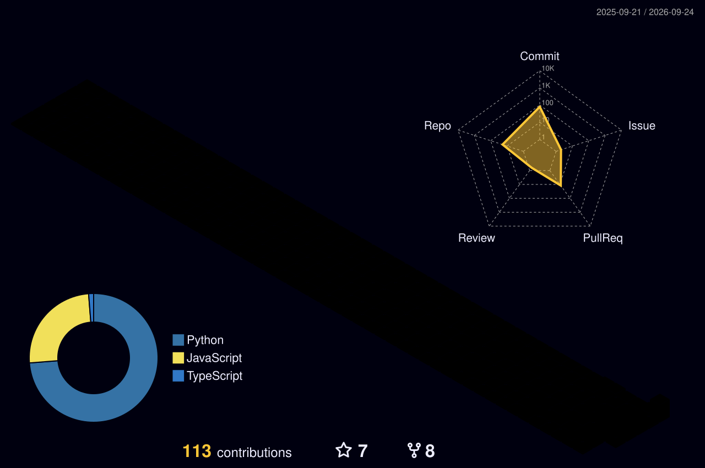

<table style="border-color: transparent;" cellspacing="0">
<tr>
<td valign="center" width="62%">

# Building Intelligent Systems

**AI Development**

I build AI-driven tools and systems that turn ideas into practical, usable software.

**Code Meets Intelligence**

Python helps me move quickly, C and C++ bring me closer to the machine, and web technologies make intelligent systems accessible to people.

**Open Questions**

How can we make AI systems more useful, reliable, and natural to work with—not only as models, but as complete products?

</td>
<td valign="top" width="38%">
<p align="right">

***

> Human × AI, one system at a time.

***



***

> 把智能变成真正可用的工具

***

</p>
</td>
</tr>
</table>

<table style="border-color: transparent;" cellspacing="0">
<tr>
<td valign="top" width="64%">

[](https://www.python.org/)
[](https://en.cppreference.com/w/c)
[](https://isocpp.org/)
[](https://developer.mozilla.org/docs/Web/HTML)
[](https://developer.mozilla.org/docs/Web/JavaScript)
[](https://github.com/IT-coder-Yy)
[](https://github.com/IT-coder-Yy)

<!--START_SECTION:profile-stats-->
**Coding Rhythm**

> Automatically updated by GitHub Actions · Last updated: 2026-08-16 18:46 UTC · Asia/Shanghai

Based on the latest **7** public Push events / 基于最近 **7** 次公开 Push 记录：

| Most Active Time | Most Productive Day | Main Language |
|:---:|:---:|:---:|
| Evening / 傍晚 🌆 | Friday / 周五 | JavaScript |

### Time Distribution / 时段分布

```text
🌞 Morning / 上午 (06-12)       0 Pushes  ░░░░░░░░░░░░░░░    0.0 %
🌆 Afternoon / 下午 (12-18)       1 Push  ██░░░░░░░░░░░░░   14.3 %
🌃 Evening / 傍晚 (18-24)       5 Pushes  ███████████░░░░   71.4 %
🌙 Late night / 深夜 (00-06)      1 Push  ██░░░░░░░░░░░░░   14.3 %
```

### Weekday Distribution / 星期分布

```text
🐔 Monday / 周一       0 Pushes  ░░░░░░░░░░░░░░░░░░░░    0.0 %
🐱 Tuesday / 周二      0 Pushes  ░░░░░░░░░░░░░░░░░░░░    0.0 %
🐶 Wednesday / 周三    0 Pushes  ░░░░░░░░░░░░░░░░░░░░    0.0 %
🐮 Thursday / 周四     0 Pushes  ░░░░░░░░░░░░░░░░░░░░    0.0 %
🐯 Friday / 周五       3 Pushes  █████████░░░░░░░░░░░   42.9 %
🐰 Saturday / 周六     3 Pushes  █████████░░░░░░░░░░░   42.9 %
🐲 Sunday / 周日         1 Push  ███░░░░░░░░░░░░░░░░░   14.3 %
```

### Language Distribution / 语言分布

```text
JavaScript    267.7 KB  █████████████░░░░░░░░░░░   54.1 %
TypeScript    216.6 KB  ███████████░░░░░░░░░░░░░   43.8 %
Python         10.5 KB  █░░░░░░░░░░░░░░░░░░░░░░░    2.1 %
```
<!--END_SECTION:profile-stats-->

</td>
<td valign="top" width="36%">

**Currently**

> Building around AI

<table style="border-color: transparent;" cellspacing="0">
  <tr>
    <td valign="center">AI-native tools</td>
  </tr>
  <tr>
    <td valign="center">Agentic workflows</td>
  </tr>
  <tr>
    <td valign="center">Intelligent systems</td>
  </tr>
  <tr>
    <td valign="center">Web interfaces</td>
  </tr>
</table>

**Traces**

<table style="border-color: transparent;" cellspacing="0">
  <tr>
    <td valign="center">
      <a href="https://github.com/IT-coder-Yy">
        
      </a>
    </td>
  </tr>
  <tr>
    <td valign="center">
      <a href="https://github.com/IT-coder-Yy">
        
      </a>
    </td>
  </tr>
  <tr>
    <td valign="center">
      <a href="https://github.com/IT-coder-Yy">
        
      </a>
    </td>
  </tr>
  <tr>
    <td valign="center">
      <a href="https://github.com/IT-coder-Yy">
        
      </a>
    </td>
  </tr>
</table>

</td>
</tr>
</table>

<table style="border-color: transparent;" cellspacing="0">
<tr>
<td valign="top" width="34%">

### Direction

AI as an engineering material.

I am interested in the tools, interfaces, memory, and infrastructure that turn intelligence into dependable software.

</td>
<td valign="top" width="33%">

### Experiments

Small, runnable systems first.

Build it, test it, break it, understand it, and keep shaping it until the idea becomes useful.

</td>
<td valign="top" width="33%">


</td>
</tr>
</table>

<details>
<summary>About the activity stats / 关于活动统计</summary>
<br>

The charts use recent public GitHub Push events. Language distribution aggregates repository language bytes for repositories found in those events. Times are displayed in the Asia/Shanghai timezone.

图表基于近期公开 Push 事件生成；语言分布汇总这些事件所涉及仓库的语言数据，时间统一按 Asia/Shanghai 时区展示。

</details>

<p align="right">Building with AI, one useful system at a time.</p>
